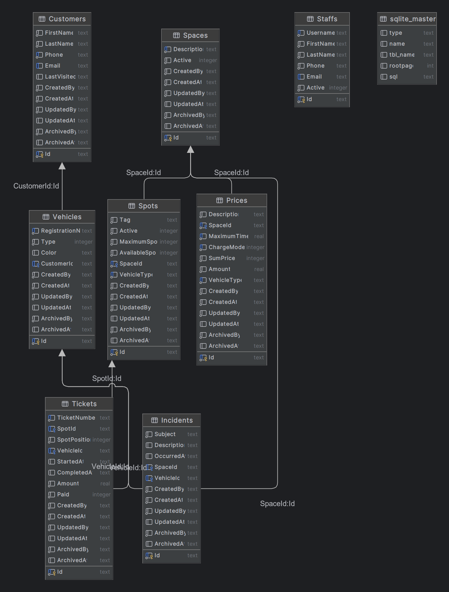

# Parking Space

A sample project to showcase using dotnet 6.0 web API project with common software development priciples
such as SOLID, YAGNI, KISS etc, and basic understanding of angular framework.

## Features on project
* Swagger docs (prod: /api-docs, development: /swagger)
* Xunit tests ticket prices
* Asp.net Core SPA Proxy from angular
* Basic Angular sample (Space, Price)
* API Response status
* Additional backend development best pratices (services, repository, entity configuration)

## Requirements

* dotnet: 6.0.300
* nodejs: V14
* npm: v6


## Tests

Tickets test are located at the [ParkingSpace.Tests.ProblemSolutions] namespace.

```
Service
    ├── Api
    │   ├── SpaceApiTests.cs
    │   └── SpotApiTests.cs
    ├── PriceResolverTests.cs
    ├── ProblemSolutions
    │   ├── No0SmallMotorCycleScooterParkingLot.cs
    │   ├── No1MallParkingLot.cs
    │   ├── No2StadiumParkingLot.cs
    │   └── No3AirportParkingLot.cs
    ├── Services
    │   ├── GenericRepositoryTests.cs
    │   └── SpaceServiceTests.cs
```

### Sample ticket test are:

```
Parking Ticket:
==============
Vehicle: motorcycle-00
Ticket Number: 3069D38C
Spot Number: 1
Entry Date-time: 4/25/2023 12:33:24PM +01:00
Exit Date-time: 4/25/2023 1:28:24PM +01:00
Fee: 0

Parking Ticket:
==============
Vehicle: motorcycle-01
Ticket Number: 2B350EA4
Spot Number: 1
Entry Date-time: 4/24/2023 10:29:24PM +01:00
Exit Date-time: 4/25/2023 1:28:24PM +01:00
Fee: 60

Parking Ticket:
==============
Vehicle: motorcycle-02
Ticket Number: 2E4E0BC5
Spot Number: 1
Entry Date-time: 4/24/2023 1:28:24AM +01:00
Exit Date-time: 4/25/2023 1:28:24PM +01:00
Fee: 160
```


## Backend Entities




## Sample Angular API Usage


